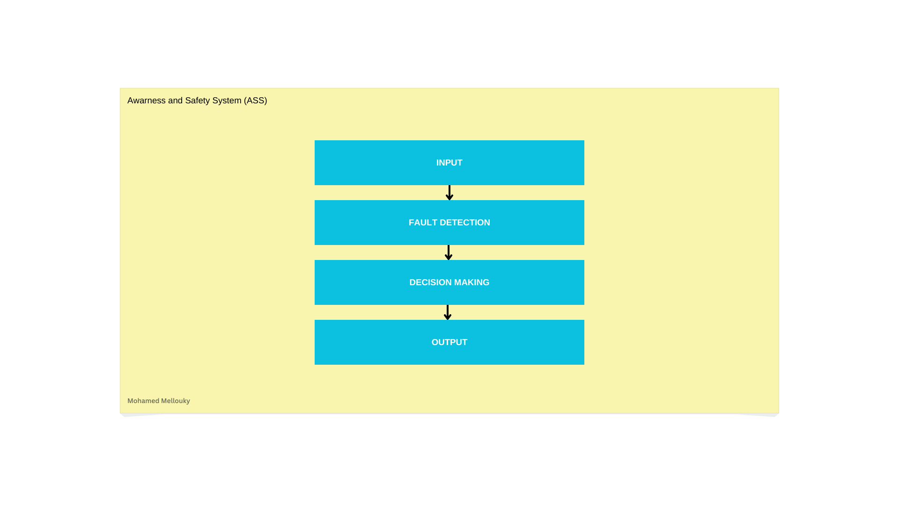

# System architecture

This page explains the architecture of the system. It uses a layered architecture. Also, it is composed of 
fours layers.    

The following is the architecture of the system:    

- The first layer is the **input layer**. It is responsible of fetching data from sensors. However, we assume that the vehicle's sensors sends angular velocity instead of sending directly the actual speed of the vehicle. Therefore, the **input layer** will take the responsability of calculating the speed. Then, it sends the output to the **fault detection layer**    
- The **Fault Detection Layer** adds reliability to the system. The ASS is a critical system embeded in vehicles. So it is crucial to elaborate with reliable data -in order to produce reliable results => take the right decision.  
At the moment. This layer is abstract. We have not determined how to implement it. However, its behaviour is quite clear. This layer should analize data and conclude if any of the vehicle's sensors is faulty. The output of **Fault detection layer** is the speed of the vehicle and a message in which it says if a sensor is faulty. If sensor is faulty, this layer should specify which one does not provide accurate data.  

- **Decision making layer** is the third layer of the architecture. This layer should decide wether to limit the speed of the vehicle or not. 

- **Output layer** in real life should shows to the drivers the decision taken by the system. Note that this layer is important. The driver should know how the system behave. The presence of the driver is mandatory. As this is a side project -there is any intent to implement it in real life (Why not :D)- the output will be a in form of loging framework. 

**Note that this is a side project. It is not designed to be implemented in real life/time systems. However, it will try to respect real time systems requirements as much as it can.**

